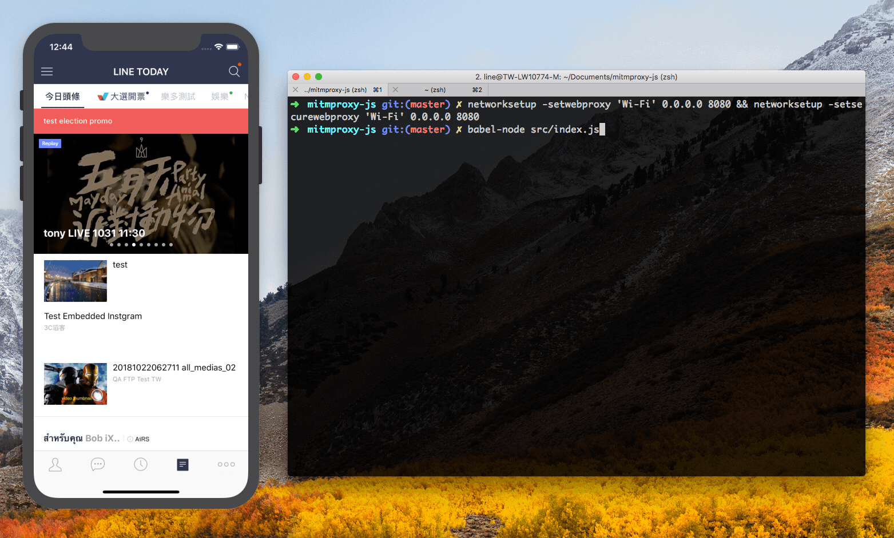

# mitmproxy-js

Rewrite network requests using Node.js!

Thanks to [https://github.com/jvilk/mitmproxy-node](https://github.com/jvilk/mitmproxy-node)

<p class="text-center">
  
</p>

## Getting Started

## Pre-requisites

- **python 3.6** ( It's not working with python 3.7 )

```
brew install https://raw.githubusercontent.com/Homebrew/homebrew-core/f2a764ef944b1080be64bd88dca9a1d80130c558/Formula/python.rb
```

- [mitmproxy v4](https://mitmproxy.org/)
- `npm install`

## Start

```
npm start
```

Then you can start intercepting network requests using node.js.

## Development

To intercept a request, define your own handers under `src/handlers/`. Then your handlers will be [loaded](src/index.js) automatically.

[Example handler](src/handlers/boilerplate/index.js):

```js
import shouldHandleRequest from './shouldHandleRequest';

const fn = async (interceptedMsg) => {
  if (shouldHandleRequest(interceptedMsg)) {
    console.log(interceptedMsg.request.url.pathname);
  }
  return interceptedMsg;
};

export default fn;
```

## Notes

### Convenient Scripts for Mac

toggle on proxy

```
networksetup -setwebproxy 'Wi-Fi' 0.0.0.0 8080 && networksetup -setsecurewebproxy 'Wi-Fi' 0.0.0.0 8080
```

toggle off proxy

```
networksetup -setwebproxystate 'Wi-Fi' off && networksetup -setsecurewebproxystate 'Wi-Fi' off
```
